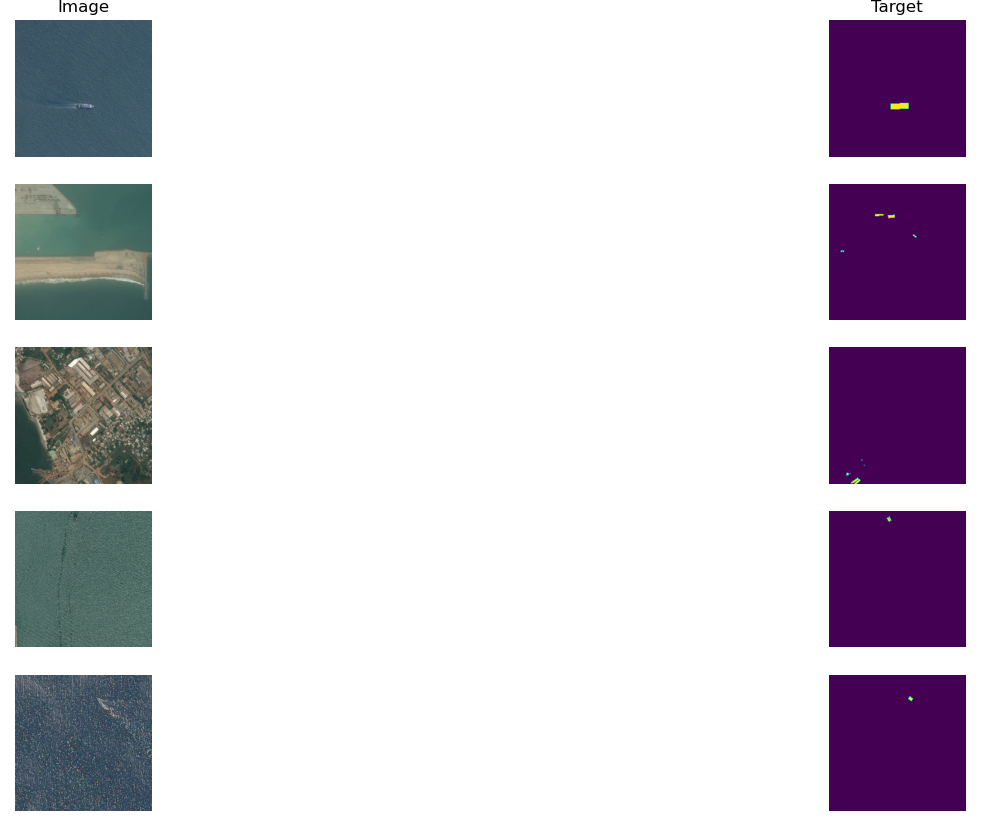
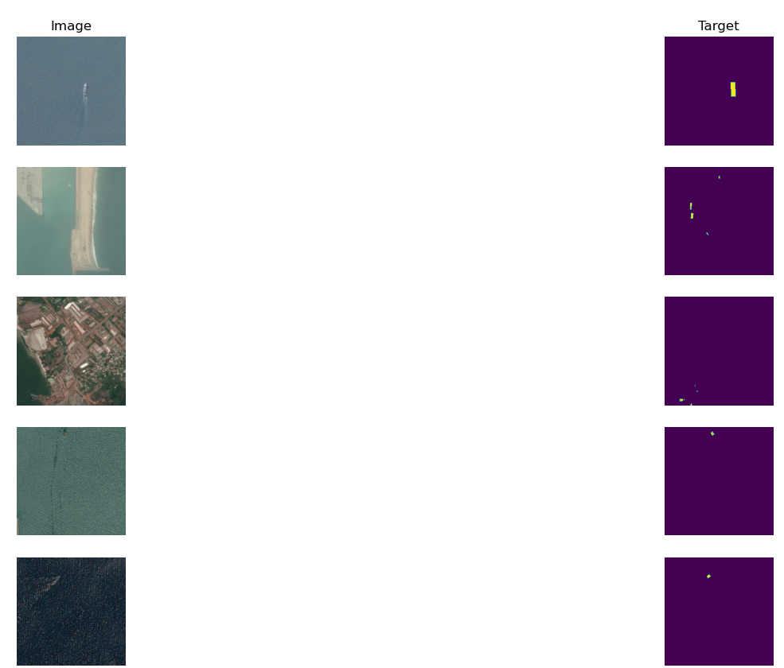
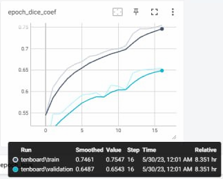
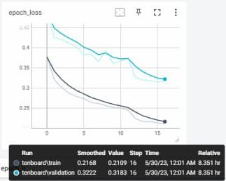
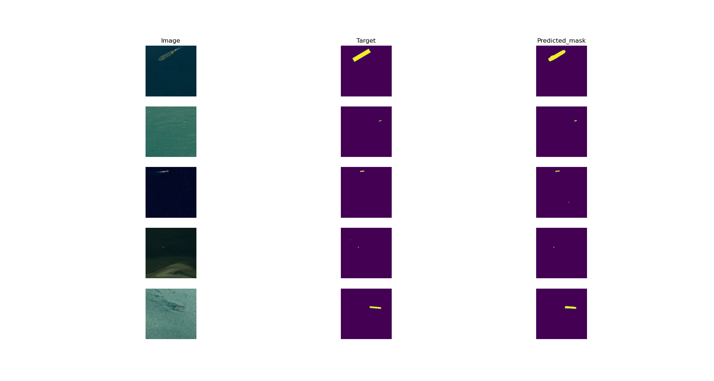
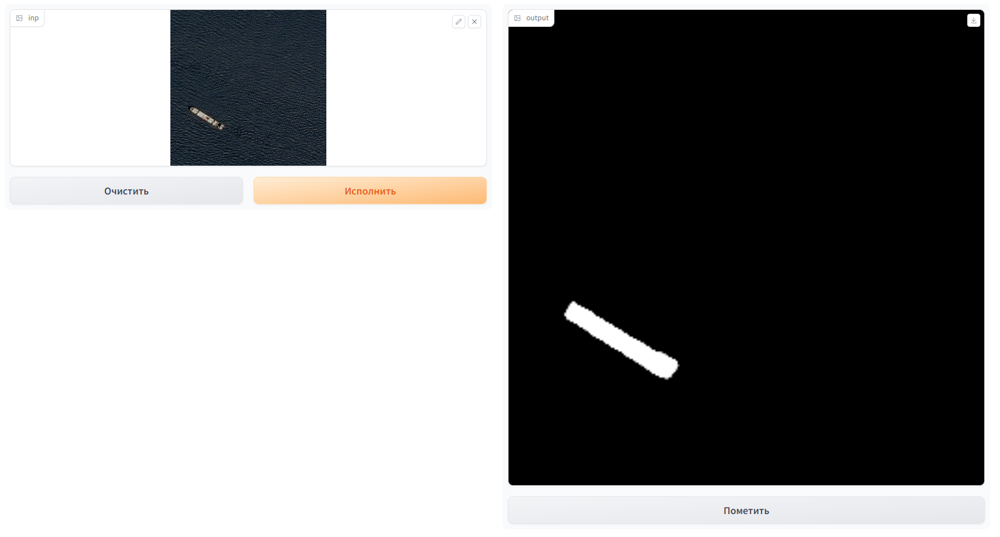

# Test task for Data Science R&amp;D center Winstars

The competition is [Airbus Ship Detection Challenge](https://www.kaggle.com/competitions/airbus-ship-detection/overview). The goal of the test project is to build a semantic segmentation model.

## Installation 

* Create the new environment
```commandline
conda create -n test-task python=3.9 anaconda
```
```commandline
conda activate test-task
```
```commandline
pip install -r requirements.txt
```

## Data preparation 

First of all you need to download the data from competition and extract it to *./dataset_folder* folder.
The structure should be in the following way:
```commandline
├── dataset_folder
│   ├── 00003e153.jpg
│   ├── 0001124c7.jpg
│   ├── 000155de5.jpg
│   ├── 0001b1832.jpg
│   └── and etc.
```
and 
```commandline
├──train_ship_segmentations_v2
│   ├── train_ship_segmentations_v2.csv
```
Note: because of huge size of dataset for this competition we don`t store it on github and here we store only train data.

Next step is create mask for images in competition. It will be easy to them in the future, if we want to experiment with models.

```commandline
 python datasets/preprocessing.py --path_csv train_ship_segmentations_v2/train_ship_segmentations_v2.csv --mask_folder mask_folder/
```
This command will create *mask_folder* with masks of images. It will take 2-3 minutes.

There are 42556 masks of images with ships.

## EDA

For data analysis  (EDA), [check](datasets/EDA_Airbus_Ship.ipynb) this  notebook.

## Dataloader 

To be able to train robust model, we will use augmentation. Please refer to [this](datasets/dataloader.py) script to check implementation.
All documentation about attributes, you can find there

```commandline
python datasets/dataloader.py  --image_folder dataset_folder/ --mask_folder mask_folder/
```

After using this command you should see the following pictures 

```commandline
python datasets/dataloader.py  --image_folder dataset_folder/ --mask_folder mask_folder/ 
```
This command will display results with augmentation

 

## Model 

The implementations for this model I took from [this](https://github.com/nikhilroxtomar/Semantic-Segmentation-Architecture/blob/main/TensorFlow/inception_resnetv2_unet.py) repo.
There are a lot of different models based on Unet architecture. In my experiments, I used vgg19_unet, vgg16_unet, however I chose inception_resnetv2_unet.
To check the architecture, just run:
```commandline
python models/inception_resnetv2_unet.py
```
## Training

For training model I used the following parameters:
* optimizer - AdamW optimizer with default parameters 
* loss - weighted_bce_dice_loss function. Script for this function I take from [here](https://www.kaggle.com/code/lyakaap/weighing-boundary-pixels-loss-script-by-keras2/script)
The training script for the model 
* metric - dice coefficient  
* image_size - (256,256)
* batch_size - 8 on training and 4 on validation


```commandline
python train.py --save_dir checkpoints/ 
                --save_name inception_resnetv2_unet.h5 
                --image_folder dataset_folder/ 
                --mask_folder mask_folder/ 
                --logs logs/ 
                --batch_size 1
                --epochs 25
                --lr 0.001
                --patience 3
                --weight_decay 0.004
                --image_size 256
```

The results of training model you can get by 
```commandline
tensorboard --logdir logs
```

I trained the model 18 epoch in Kaggle platform. One epoch took 27 minutes

 


## Inference 
There are two options to make inference:
* use inference function for images with masks or only images
* use *demo_gradio.py* 

To do inference, run :
```commandline
python inference.py --checkpoint checkpoints/inception_resnetv2_unet.h5 --image_folder dataset_folder/ --mask_folder mask_folder/
```
The result should be the following on validation data



The second option is use [Gradio](https://gradio.app/)to create demo in quick way.

```commandline
python demo_gradio.py --checkpoint checkpoints/inception_resnetv2_unet.h5
```

Upload image and run the application. for example:



## Conclusions

Here, I want to share my ideas and thought. It is an interesting and challenging competitions with a lot of problems .
First of all it is data, there is a huge unbalance between images with/without ships. More than 73% of images don`t have ships.
Moreover, images with ships also have bottlenecks, more than 96% of image is sea/landscape etc.

So I decided to use only
images with ships, because of size of ships. Even on these images, we still have unbalance. The next step is choosing the model. 
I spent times on this, because a simple Unet will fail, so I tried to find a model that could segment a small object.
I found papers with code, [this](https://github.com/danfenghong/IEEE_TIP_UIU-Net/tree/main), however I decided to skip this idea, because if I fail and cant train the model
I will not meet my deadline. At this point, I found github with different Unet like architecture and chose [inception_resnetv2_unet](https://github.com/nikhilroxtomar/Semantic-Segmentation-Architecture/blob/main/TensorFlow/inception_resnetv2_unet.py).

After first run I  have got a weak result. The prediction shows me that my model cant segment images with medium-sized ships.
That is why I added augmentation, weighted bce dice loss amd AdamW. Even small ships, my model can segment them.
Еraining process shows me a clear overfitting. On the training data 0.7547 and 0.6543 on validation (dice_coef). After this
I checked the performance on validation images and found that the problem is waves. Sometimes, model is confused because of them, model things that is small ships 
or segment the shadow of the ships that out of segmentation. Some of the cases (waves, landscape) we can fix based of threshold.
In Gradio or *inference.py* we can play with this value and achieve better result.


Moreover, with landscape the model works fine, so the solution might be is using detection model.
For this dataset, we have masks (bounding boxes) of the ships. After detection, we can crop the detection from image and 
try to segment the ship and based on threshold create final bboxes of ship.

Ofcourse, I don't have time for this implementation, but I think the better solution is combination of detection ,segmentation and postprocessing.

